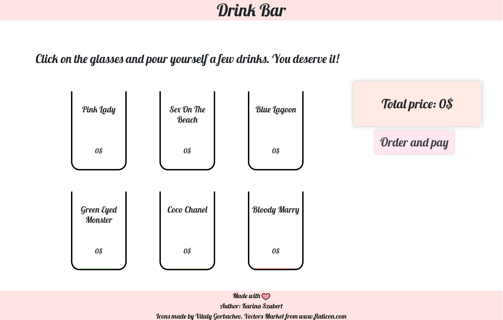
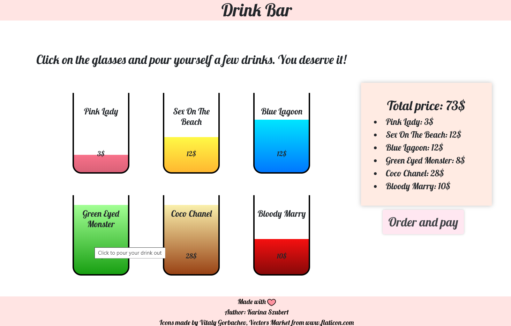
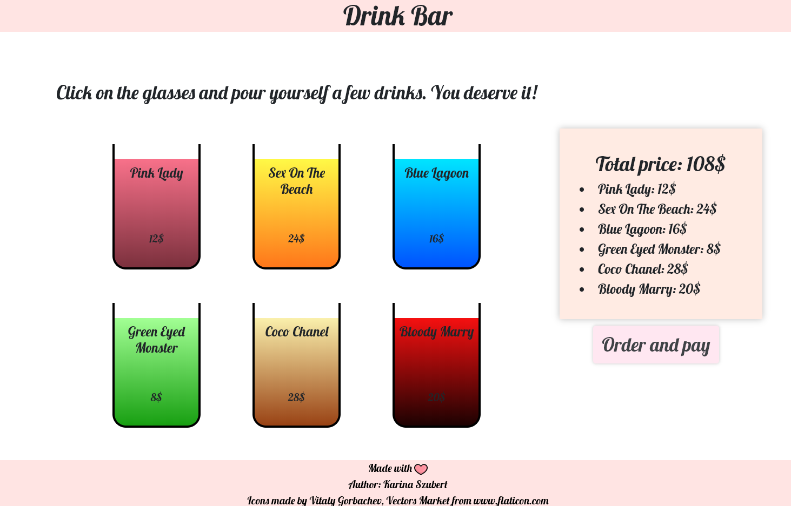

# Drink Bar

If you are after a hard day at work, bored or just need a moment of relaxation, you should definitely visit my Drink Bar. It offers a variety of luxurious drinks at diverse prices. You surely won't find any better place to pour yourself a drink in the whole internet! You're more than welcome :)

## Usage

-   In this bar, you can be served instantly, as you enter the website. There's no queue because you are our special guest.

      

-   You can adjust the amount of a chosen beverage by clicking on it. There are four levels of filling a glass.

-   If you change your mind and want to pour a drink out, you can do so by clicking on it when it's full.

      

-   Every cocktail has its unique price. Moreover, the value of the drink can vary, depending on the level of filling the glass.

-   On the right side of the website, you can see the summary of your order. With each click, the bill is immediately updated and the total cost is calculated.

    

-   I advise you to use Google Chrome, Mozilla Firefox or Opera, to open my project (but only in Firefox you can see the animated favicon I've made).

## Built With

-   HTML5
-   CSS
-   JavaScript

## Authors

**Karina Szubert** (https://github.com/Karina-00)

## License

[Mozilla Public License 2.0](https://choosealicense.com/licenses/mpl-2.0/)
